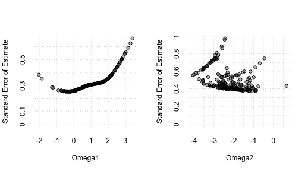
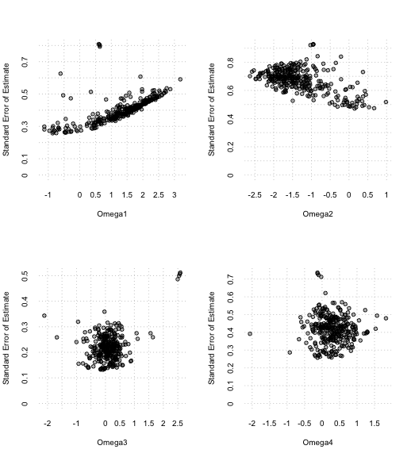
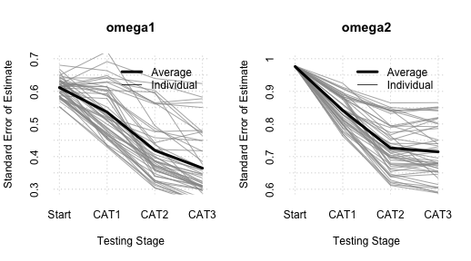

``` r
library(cogirt)
```

# Introduction

## Compare Models

In the code below, models were fitted to the Example 2 (ex2) simulation data. The ex2 data are based on the signal detection-weighted IRT model, and thus the sdt model should provide the best fit. These data were simulated without experimental or longitudinal structure. We fit each of the models to the data and then compare them using the lrt (likelihood ratio test) function.


``` r
fit1p <- cog_irt(data = ex2$y, model = "1p", verbose_mhrm = FALSE)
fit2p <- cog_irt(data = ex2$y, model = "2p", verbose_mhrm = FALSE)
fitsdt <- cog_irt(data = ex2$y, key = ex2$key, model = "sdt",
                  verbose_mhrm = FALSE)
lrt(fit1p, fit2p, fitsdt)
#>         logLik Par    AIC    BIC Chisq diff df diff Pr(>Chisq)    
#> fit1p  -930.47 150 2160.9 2447.7                                  
#> fit2p  -881.17 250 2262.3 2740.3      98.60     100     0.5208    
#> fitsdt -823.26 200 2046.5 2428.9     115.81      50  3.884e-07 ***
#> ---
#> Signif. codes:  0 '***' 0.001 '**' 0.01 '*' 0.05 '.' 0.1 ' ' 1
```

The lrt function reports model log-likelihood values (logLik), the number of parameters estimated for each model (Par), Akaike and Bayesian Information Criterion values (AIC and BIC), the difference in model Chisq values, the degrees of freedom for the difference between models (Chisq diff), and the probability values for the differences (Pr(>Chisq)). As can be seen, the signal detection model produces the best fit (lowest AIC and BIC). The cogirt package also provides summary methods as shown below. The model used will ultimately determine the interpretation of each Omega parameter.


``` r
summary(fitsdt)
#> 
#>  ------------------------------------------------------------------------- 
#>  cogirt: IRT Estimates for the Signal Detection-Weighted IRT Model 
#>  ------------------------------------------------------------------------- 
#>  
#>  Number of Subjects =  50 
#>  Number of Items    =  100 
#>  log-Likelihood     =  -823.2627 
#>  
#>                       Mean              SD      Median SEE     Reliability 
#>  Omega1              2.110           0.788           0.681           0.608 
#>  Omega2              0.883           0.551           0.389           0.711 
#>  Nu                  0.752           0.596           0.566           0.347 
#> 
#>  -------------------------------------------------------------------------
```

In the summary table, Omega1 corresponds to the signal detection theory discrimination parameter (d'), and Omega2 corresponds to the signal detection theory bias parameter (C-centered).

## Fit a Model to Multi-Time-Point Data with Constrained Item Parameters

In the next example, a two-parameter IRT model is fitted to the Example 4 (ex4) data. The ex4 data were simulated based on a two-parameter IRT model and a hypothetical longitudinal study design. Specifically, it was assumed that the same 25 items were administered at 2 time-points to 200 examinees. Because the same items were hypothetically administered at each time point, the item slope parameters (lambda) and item intercept parameters (nu) were constrained to be equal across time. In the code below, the constraints argument is set to TRUE, which constrains the item parameters to be equal over the 2 time-points.


``` r
fit2pconstr <- cog_irt(data = ex4$y, model = '2p',
                             contrast_codes = "contr.treatment",
                             num_conditions = 2, num_contrasts = 2,
                             constraints = TRUE, verbose_mhrm = FALSE)
```

The cogirt package also provides plot methods. We plot the ex4 fitted model object (fit2pconstr). The plot shows the standard error of estimate for the fitted parameters. Note that in the function call we used the R base stats package contr.treatment function to define the contrast_codes argument. contr.treatment produces weights that follow the so-called "dummy coding" scheme. These are not true contrast codes because they do not sum to 0. However, in the context of longitudinal research, this coding scheme may sometimes be preferable because the first estimate (Omega1) corresponds to the subject's time 1 score and the second estimate corresponds to the subject's change or difference score between the first and second time point (Omega2). Thus, in the plot, this implies that the first panel (Omega1) corresponds to time 1 scores, and the second panel corresponds to difference scores (Omega2).


``` r
plot(fit2pconstr)
```



## Fit a Model with Parameters for Experimental Structure

This example uses the real (i.e., non-simulated) nback data that comes installed with the cogirt package. The nback data comprise 100 item responses by 320 examinees across 4 memory load conditions. Since these are forced-choice accuracy data, we again use the signal detection-weighted model. We first fit the SDT model without any contrast effects.


``` r
nback_fit <- cog_irt(
  data = nback$y,
  model = "sdt",
  key = nback$key,
  verbose_mhrm = FALSE
)
```

We then summarize and plot the results.


``` r
summary(nback_fit)
#> 
#>  ------------------------------------------------------------------------- 
#>  cogirt: IRT Estimates for the Signal Detection-Weighted IRT Model 
#>  ------------------------------------------------------------------------- 
#>  
#>  Number of Subjects =  320 
#>  Number of Items    =  100 
#>  log-Likelihood     =  -11071.84 
#>  
#>                       Mean              SD      Median SEE     Reliability 
#>  Omega1              1.126           0.828           0.347           0.836 
#>  Omega2              0.195           0.476           0.181           0.855 
#>  Nu                  0.507           0.650           0.107           0.968 
#> 
#>  -------------------------------------------------------------------------
plot(nback_fit)
```


To explore how memory load affects performance, we can add linear contrast effects. These contrasts model systematic changes across the memory load levels.


``` r
nback_fit_contr <- cog_irt(
  data = nback$y,
  model = "sdt",
  contrast_codes = "contr.poly",
  key = nback$key,
  num_conditions = 4,
  num_contrasts = 2,  # Intercept and linear
  verbose_mhrm = FALSE
)
```

We then summarize and plot the results.


``` r
summary(nback_fit_contr)
#> 
#>  ------------------------------------------------------------------------- 
#>  cogirt: IRT Estimates for the Signal Detection-Weighted IRT Model 
#>  ------------------------------------------------------------------------- 
#>  
#>  Number of Subjects =  320 
#>  Number of Items    =  100 
#>  log-Likelihood     =  -10170.93 
#>  
#>                       Mean              SD      Median SEE     Reliability 
#>  Omega1              1.290           0.855           0.401           0.814 
#>  Omega2             -1.300           0.702           0.685           0.518 
#>  Omega3              0.095           0.470           0.220           0.810 
#>  Omega4              0.298           0.417           0.422           0.491 
#>  Nu                  0.541           0.588           0.110           0.958 
#> 
#>  -------------------------------------------------------------------------
plot(nback_fit_contr)
```



The output is structured so that the first set of Omega estimates corresponds to the experimental effects on one latent ability/trait, the next set of outputs corresponds to the experimental effects on the second latent ability/trait, and so on. In this case, since we are using the signal detection-weighted model, the first measured ability is discrimination and the second is bias. In our analysis, we requested 2 contrasts (intercept effect and linear effect). Thus, Omega1 is the intercept value for discrimination, Omega2 is the linear slope estimate for discrimination, Omega3 is the intercept value for bias, and Omega4 is the linear slope estimate for bias.

## Adaptive Testing

Computerized adaptive testing (CAT) is an assessment approach that uses algorithms to select optimal task items, minimizing the standard error of estimates. While CAT typically administers one item at a time, the cogirt package can also adaptively select optimal task conditions (e.g., memory load levels). cogirt supports both live and simulated adaptive testing.

The two examples below use the Example 3 (ex3) and Example 5 (ex5) datasets provided in the package. Both are based on a signal detection-weighted model with an experimental structure consisting of a task comprising 10 conditions, each with 20 items (200 items total). The difference is that ex3 is a dataset with 50 subjects, while ex5 is a single-subject dataset.

The cog_cat function operates on a single subject's data, making it suitable for live CAT applications. The example code uses the ex5 data to demonstrate the function's use. Since the simulated responses are provided for all items, most responses are set to NA in the example below to mimic a real adaptive testing situation, where only a subset of items are administered. The condition variable in the rda object helps identify items by task condition. For example, with 10 conditions of 20 items each, condition assigns values 1 through 10 to the respective item sets. In the code below, we set all items except those in condition 3 to NA (i.e., condition 3 is arbitrarily chosen to be the starting condition) and then use cog_cat to identify the next best item to administer.


``` r
# Define an rda file
rda = ex5
# Set all items that are not part of 3 to NA for demonstration purposes (if not already NA)
rda$y[which(!rda$condition %in% c(3))] <- NA
# Determine next condition to administer
cog_cat(rda = rda, obj_fun = dich_response_model, int_par = 1)
#> $omega1
#>          [,1]      [,2]        [,3]       [,4]
#> [1,] 2.073415 -1.908678 -0.09465789 0.05455807
#> 
#> $se_omega
#> [1] 0.7081466 0.8256730 0.3775583 0.3141252
#> 
#> $next_condition
#> [1] 10
```

The output indicates that condition 10 will provide the most precise estimates of the intentional parameter (int_par). The information from this return list can be passed to software for stimulus presentation and response collection, such as PsychoPy or custom HTML/JavaScript. Most of the information about the model and parameter estimation is passed to the function via the rda object (see the package documentation for details on what the rda object must include).

In addition to live adaptive testing, the cogirt package supports simulated adaptive testing using the cog_cat_sim function, as demonstrated in the code below.


``` r
sim_res <- cog_cat_sim(data = ex3$y, model = 'sdt', guessing = NULL,
                    contrast_codes = "contr.poly", num_conditions = 10,
                    num_contrasts = 2, constraints = NULL, key = ex3$key,
                    omega = ex3$omega, item_disc = ex3$lambda,
                    item_int = ex3$nu, conditions = ex3$condition,
                    int_par = c(1, 2), start_conditions = 3,
                    max_conditions = 3, link = "probit")
#> Estimating omega from starting conditions... 
#> Adaptive Testing Start Time 12/09/24 12:03:05 
#> ... CAT administration 1
#> ... CAT administration 2
#> ... CAT administration 3
#> Adaptive Testing End Time 12/09/24 12:06:42
```

The summary method for cog_cat_sim provides details about the simulation, including bias, mean absolute error (MAE), and root mean square error (RMSE) for each Omega parameter specified by the int_par argument (i.e., the intentional parameter). Bias and MAE are calculated using either the true Omega values (if known from a simulation) or estimates derived from all available data. The plot method displays the individual and average standard errors of the estimates for each Omega parameter selected for adaptive testing.


``` r
summary(sim_res)
#> 
#>  ------------------------------------------------------------------------- 
#>  cogirt: Results of Simulated Computerized Adaptive Testing 
#>  ------------------------------------------------------------------------- 
#>  
#>  Model                            =  sdt 
#>  Number of Conditions             =  10 
#>  Maximum Conditions Criterion     =  3 
#>  Minimum Standard Error Criterion =  -Inf 
#>  
#>                       Bias             MAE            RMSE 
#>  Omega 1            -0.163           0.356           0.449 
#>  Omega 2             0.325           0.570           0.757 
#> 
#>  -------------------------------------------------------------------------
plot(sim_res)
```



